# SM Warisul A. Rafin

By day, Director of the SaaS department at [Orpheus](https://orpheusit.com/), leading our SaaS products, most of them AI.

By night, founder of [athrLabs](https://athr.app): AI fine-tuning, AI products, web design, system and infrastructure management, automation, and whatever else I feel like building.

Before all that: sysadmin, DevOps, full-stack. I still run a bunch of servers at home and self-host most of what I use.

athrLabs is where that work goes to clients: systems with AI integrated into them, so repetitive work stops being someone's task.

Elsewhere: [warisul.com](https://www.warisul.com) · [blog](https://blog.warisul.com) · [LinkedIn](https://www.linkedin.com/in/warisul-rafin) · [contact@warisul.com](mailto:contact@warisul.com)
