  

  I'm a Cloud Infrastructure Architect and DevOps engineer focused on resilient, cost-aware platforms
  across AWS and hybrid cloud. Currently deep in infrastructure as code, platform automation, and
  security-first architecture — always open to talking about distributed systems, migrations, and
  developer experience. Projects live at <a href="https://projects.warisul.com/">projects.warisul.com</a>.

  

  

  <a href="https://www.warisul.com">Portfolio</a> ·
  <a href="https://www.linkedin.com/in/warisul-rafin">LinkedIn</a> ·
  <a href="https://github.com/wari-sul">GitHub</a> ·
  <a href="https://twitter.com/warisul">Twitter</a> ·
  <a href="mailto:contact@warisul.com">Email</a>

  SM Warisul A. Rafin — hand-built SVGs, no widgets.

